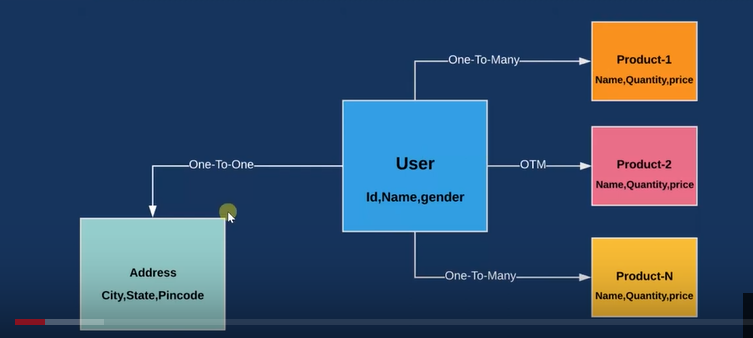
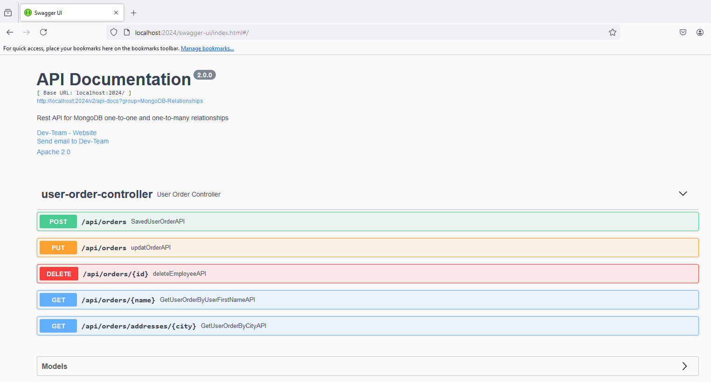
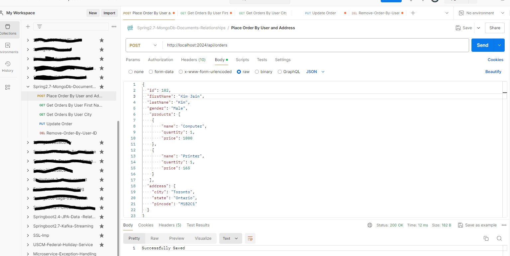

#Spring-MongoDB-embedded: Model One-to-One, One-to-Many Relationships Embedded Documents (collections).
- The REST API has been built with Spring boot (2.7.1), java 8 with MongoDB for this demo.
- Change application.properties for DB connection attributes (db name, user and password).

## Architecture
- One user can have multiple products and user has one address.
-

## Endpoints
- http://localhost:2024/api/orders -Place Order.
- http://localhost:2024/api/orders{firstName} -Get all orders by user first name.
- http://localhost:2024/api/orders/addresses/{city} -Get all orders by city.
- http://localhost:2024/api/orders -Update order.
- http://localhost:2024/api/orders/{id} -Delete order by user Id.
- Validations:
- id  -The "id" must be numeric and between 1 and max integer.
- firstName -The"firstName" is required &  it must be at least 3 characters. The firstName must be one word.
- address -The "address" is requried.
- city -The city of the address must be at least 3 characters. The city name must be one word.
- products -At least one product is required to place order.
- name -The name of "product' must not be empty and it must be at least 3 characters.
 
 
## API Documentations 
-
- http://localhost:2024/swagger-ui/index.html -Swagger2 API documentation 

## Import postman collections to test APIs
-
